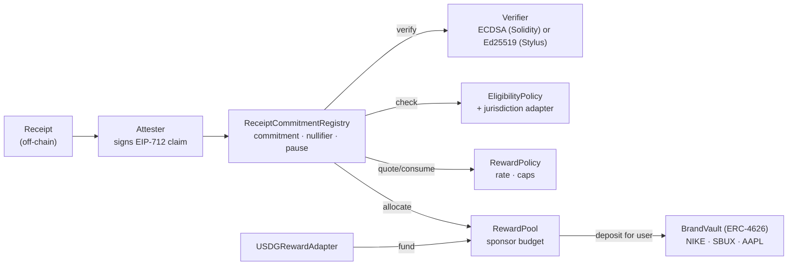

# STOCKBACK

### Proof-of-Purchase → Proof-of-Ownership

**Scan. Prove. Own.**

STOCKBACK turns an **attested real-world purchase** into **pooled ownership exposure** in the brand you bought from. It runs on Arbitrum, with Solidity for settlement and policy and **Stylus (Rust)** for signature verification the EVM can't do natively.

> **Hackathon MVP. Testnet / demo only. Not audited.** Brand assets in the demo are fictional mock tokens, not securities (see [Compliance](docs/COMPLIANCE.md)).

---

## Problem

Every purchase generates evidence: a receipt, a UPI reference, an invoice. Loyalty programs turn that evidence into points that are closed-loop, expire, and can't be owned or moved. Generic crypto cashback pays tokens unrelated to what the customer buys, and usually can't show that a purchase was real or claimed only once.

## Solution

```
Evidence ──▶ Attestation ──▶ Commitment + Nullifier ──▶ Eligibility ──▶ Capped reward ──▶ Brand-vault shares
(off-chain)   (signed)        (on-chain, hashes only)    (policy)        (policy+budget)   (ERC-4626)
```

A user buys Nike shoes for ₹2,000. An attester vouches for the purchase and signs a claim that contains only hashes. The user submits it. The contracts check the signature, reject replays, apply the brand's rules and caps, and deposit 0.75% of the value from a sponsor-funded budget into the **Nike brand vault** on the user's behalf. The user now holds vault shares: pooled exposure to a brand they actually buy from.

**The vault is not the moat. The moat is the verification and eligibility pipeline** connecting an off-chain economic event to an on-chain ownership allocation.

## Architecture



More diagrams (sequence, dependencies, trust boundaries, USDG flow, claim state machine) are in **[docs/ARCHITECTURE.md](docs/ARCHITECTURE.md)**.

| Layer | Contract | Responsibility |
|---|---|---|
| Evidence | `tools/attester.mjs` (demo) | Normalize receipt, hash identifiers with a secret salt, sign the EIP-712 claim |
| Proof | `ReceiptCommitmentRegistry` | Claimant binding, deadline, commitment (claim ID), nullifier, orchestration, pause |
| Proof | `ECDSAAttestationVerifier` / `stylus/receipt-prover` | Yes/no: did an allowlisted attester sign exactly this claim? |
| Eligibility | `EligibilityPolicy` (+ `IJurisdictionPolicy`) | Brand active, currency, amount bounds, purchase age, optional KYC/region gate |
| Eligibility | `RewardPolicy` | `reward = amount × rate × multiplier`; per-claim cap, daily user cap, daily brand cap |
| Ownership | `RewardPool` | Sponsor-funded budget per brand; pays only what was deposited |
| Ownership | `BrandVaultFactory`, `BrandVault` | One admin-less ERC-4626 vault per brand (CREATE2, salt = brandId) |
| USDG | `USDGRewardAdapter` | Optional: fund budget in USDG → swap to brand asset with oracle-bounded slippage |

### Stylus role

The EVM has precompiles for keccak and secp256k1, but none for **Ed25519**, a signature scheme widely used for service-to-service signing. `stylus/receipt-prover` verifies Ed25519 attestations in compiled Rust behind the same `verify(bytes32,bytes)` ABI as the Solidity verifier, so the registry can use either. Stylus does verification only; settlement, accounting and policy stay in Solidity.

### ERC-4626 role

Rewards are deposits into a brand vault on the user's behalf. Users hold standard, composable vault shares instead of scattered token dust. Vaults have no owner, no pause and no sweep. `_decimalsOffset = 6` makes first-depositor inflation attacks unprofitable (tested).

### USDG role

USDG is an optional **funding adapter**, not a dependency. A merchant or sponsor pays the reward budget in USDG, and the adapter swaps it into the brand asset through SwapRouter02, with oracle freshness checks and a slippage bound (patterns reused from Wield). **No yield or APY is assumed.** The demo uses `MockUSDG`.

## Security, privacy, limits

- **Anti-replay**: `nullifier = keccak(tag, merchantId, receiptHash)`. The same receipt cannot be claimed twice, even with a different claimant, amount, brand or deadline.
- **Anti-front-running**: the claimant is signed and must be `msg.sender`.
- **Domain separation**: EIP-712 over chain ID and registry address. Cross-chain and cross-deployment replays are tested.
- **Bounded authority**: the verifier only returns a bool; only the registry spends budget; vault assets are unreachable by any admin. A compromised attester, verifier or owner is bounded by the caps and the unallocated budget.
- **Anti-Sybil (partial, honestly)**: nullifiers stop receipt replay, **not** multi-wallet farming. The MVP limits are per-wallet and per-brand daily caps, per-claim caps, budgets, and an optional KYC/jurisdiction adapter.
- **Privacy**: raw receipts, UPI IDs, names, phones and emails never go on-chain. Receipt hashes are salted. Amount, merchant hash and time are public; see **[docs/PRIVACY.md](docs/PRIVACY.md)**.
- **Compliance**: geography is an adapter, not hardcoded. Mock assets refuse to deploy on production chains. Production needs issuer authorization and legal review; see **[docs/COMPLIANCE.md](docs/COMPLIANCE.md)**.

Full checklist, with the test that covers each risk: **[SECURITY.md](SECURITY.md)**.

## Benchmark

Workload: strict Ed25519 verification of attestation signatures, the check the registry delegates to its verifier. Measured on **Robinhood Chain testnet** with `eth_estimateGas`, byte-identical calldata, both contracts deployed on the same chain:

| batch | Solidity Ed25519 | Stylus Ed25519 | Solidity ÷ Stylus |
|---:|---:|---:|---:|
| 1 | 736,502 gas | 140,063 gas | 5.3× |
| 10 | 6,214,368 gas | 724,659 gas | 8.6× |
| 50 | 30,555,405 gas | 3,327,511 gas | 9.2× |
| 100 | exceeds the 32M per-tx cap | 6,583,441 gas | n/a |

The marginal cost per extra signature is about 608k gas in Solidity and about 65k in Stylus. ECDSA through the EVM precompile remains cheaper still (about 5k marginal), so Stylus earns its place specifically for signature schemes the EVM lacks. Methodology and raw data: **[benchmarks/results/BENCHMARKS.md](benchmarks/results/BENCHMARKS.md)**.

## Live on Robinhood Chain testnet (46630)

| Contract | Address |
|---|---|
| ReceiptCommitmentRegistry | `0x4273b12cD4A65c2180d4e65Bcb4254825cE64120` |
| Stylus ReceiptProver (active verifier) | `0x9ae8a390121ba71545e9923b333d60e7e3ccd3bd` |
| ECDSAAttestationVerifier | `0x3d2F146142387654B8118952e38ac87aA492879A` |
| EligibilityPolicy | `0x2511F246623feFB12b1eb10B0aA3871E9595a2Cf` |
| RewardPolicy | `0x687F2903D0F8A85A6a47F84013423EC5e47353Fa` |
| RewardPool | `0xfcd0Db816184AF3bdf3Fa617E1bCDB5D6c638bB8` |
| BrandVaultFactory | `0xA8ee8029F57e5251aCEbEcD96B6aB3E345BeBA5b` |
| USDGRewardAdapter | `0xe8CDb2525eE30140f3344f2D18BAe312b1336961` |
| sbNKE / sbSBUX / sbAAPL vaults | `0x01650440F92F1A70d74a67F2da72370d34fC43b4` / `0xc5564C4209A3627E0c6e851884A1F01FA3aAC4BC` / `0x3979865D7963b9eb84183dcd9DC4024C04b3bd22` |

End-to-end transactions:

- Nike ₹2,000 claim via the ECDSA verifier: `0x4e2c8097030ef2b0842b0e6dbb79675437637dea04dfb7531d0938a13ff9c604` (15 mNKE of exposure).
- Registry switched to the Stylus verifier: `0xdef1f3214a7aae35a2b8b970aaf8276a1aae29ba8d3f873b7278f436a784c324`.
- Apple ₹14,990 claim, Ed25519 attestation verified in Stylus: `0x7fe2a51a5567bec1b96e2fa389c959368fbeda7a05bacc98c3383f544fc8d9c4` (74.95 mAAPL).

All brand assets and USDG here are **mocks**. Full list: [`deployments/46630.json`](deployments/46630.json).

## Demo flow

`script/demo.sh` runs the whole flow against a live chain (local anvil by default):

```
1. Deploy STOCKBACK (mock assets)          5. submitClaim → 266k gas, status 1
2. Receipt: Nike, ₹2,000 (stays off-chain) 6. Portfolio: 15.0 mNKE of vault exposure
3. Attester signs hashed EIP-712 claim     7. Replay same receipt → 4 = NullifierUsed
4. previewClaim → (0 = Ok, 15e18)          8. Sponsor funds budget with (mock) USDG
```

## Web app

`web/` is the consumer product: a Japanese-editorial landing page, RainbowKit wallet connection, receipt scanning with on-device OCR, a demo attester API, a real claim on Robinhood testnet, and a live portfolio and activity view. See **[web/README.md](web/README.md)**.

```bash
cd web && cp .env.example .env.local && npm install && npm run dev
```

A browser claim created through the UI with a fresh wallet, verified on chain: `0x9aa3e60bdb9a5aefc7d7cae5d9beed7a2529c3aca608776915ea60efa4cb7d92`.

## Quickstart

Requires [Foundry](https://book.getfoundry.sh), Node ≥ 18, and for Stylus: Rust (toolchain pinned in `stylus/receipt-prover/rust-toolchain.toml`) and `cargo-stylus`.

```bash
forge install --no-git foundry-rs/forge-std@6e8c4a92c9a8b31c1b0f0c39296d1fa4695c7df8 \
  OpenZeppelin/openzeppelin-contracts@69c8def5f222ff96f2b5beff05dfba996368aa79

forge build && forge test                        # 83 tests: unit, fuzz, invariant
forge test --root benchmarks/solidity -vv        # Solidity Ed25519 baseline + gas table
(cd stylus/receipt-prover && cargo test)         # Stylus verifier tests

anvil &                                          # local end-to-end demo
script/demo.sh
```

### Deploy to Robinhood Chain testnet

```bash
cp .env.example .env    # fill DEPLOYER_PRIVATE_KEY, ATTESTER_ADDRESS (faucet: https://faucet.testnet.chain.robinhood.com/)
set -a; . ./.env; set +a
forge script script/DeployStockback.s.sol --rpc-url "$RPC_URL" --broadcast --slow
# optional: Stylus verifier as the active verifier
# note: --constructor-args is variadic, keep it last
(cd stylus/receipt-prover && cargo stylus deploy -e "$RPC_URL" --private-key "$DEPLOYER_PRIVATE_KEY" --no-verify --constructor-args <owner>)
```

The demo deploy script refuses any chain other than 31337, 46630 and 421614, and writes all addresses to `deployments/<chainId>.json`.

## Repository

```
src/                      Solidity protocol (8 contracts) + interfaces + labelled mocks
stylus/receipt-prover/    Rust/Stylus Ed25519 attestation verifier
test/                     Foundry unit / fuzz / invariant / integration / security tests
script/                   DeployStockback.s.sol, demo.sh
tools/attester.mjs        Demo attester CLI (shares web/lib/attester-core.mjs)
web/                      Consumer web app (Next.js, RainbowKit, live testnet)
benchmarks/               Solidity-vs-Stylus harness, fixtures, results
config/ deployments/      Network registry, deployment outputs
docs/                     ARCHITECTURE, PRIVACY, COMPLIANCE, ANALYTICS, FRONTEND_INTEGRATION, HACKATHON, MIGRATION_AUDIT
```

## Roadmap

1. **Now**: demo video, hosted deployment of `web/`.
2. **Next**: a real merchant or payment-processor attester; multisig and timelock on configuration; claim relaying (gasless).
3. **Later**: amount privacy (range proofs), batch claims, issuer-authorized assets behind the jurisdiction adapter.

## Hackathon alignment

The mapping to the published criteria (contract quality, product-market fit, innovation, real problem solving, USDG, Robinhood Chain) is in **[docs/HACKATHON.md](docs/HACKATHON.md)**, including what is not built yet.

## License and attribution

MIT (see [LICENSE](LICENSE)). This repository started from **[Wield](https://github.com/useWield/wield-contracts)** (MIT, © 2026 Wield). **Adapted from Wield**: Foundry setup and CI, the oracle freshness and slippage checks and chain-id guards (now in `USDGRewardAdapter` and the deploy script), `IAggregatorV3`, `ISwapRouter` (corrected to SwapRouter02), and `MockUSDG` / `MockAggregatorV3`. **Original STOCKBACK work**: the claim model, registry, verifiers (Solidity and Stylus), policies, reward pool, brand vault and factory, attester, benchmark and docs. Wield's vault, basket and P2P contracts are not included; see [docs/MIGRATION_AUDIT.md](docs/MIGRATION_AUDIT.md). The benchmark baseline vendors [chengwenxi/Ed25519](https://github.com/chengwenxi/Ed25519) (Apache-2.0) under `benchmarks/solidity/src/vendor/`.
