<p align="center">
  
</p>

<p align="center">
  <b>Proof of purchase → proof of ownership.</b><br>
  Merchant-signed receipts become shares of the brand you bought from, verified in Rust on Arbitrum Stylus.
</p>

<p align="center">
  <a href="https://stockbacks.vercel.app"><b>Live app</b></a> ·
  <a href="https://youtu.be/70fX_mN6MuE"><b>Demo film (2:30)</b></a> ·
  <a href="whitepaper/STOCKBACK-Whitepaper.pdf"><b>Whitepaper</b></a> ·
  <a href="brand/png/STOCKBACK-deck.pdf"><b>Deck</b></a> ·
  <a href="SECURITY.md"><b>Security</b></a> ·
  <a href="docs/HACKATHON.md"><b>Hackathon</b></a>
</p>

<p align="center">
  
  
  
  
  
</p>

> **Hackathon MVP. Testnet / demo only. Not audited.** The merchant in the demo is simulated, and every brand asset is a mock token, not a security. No brand partnership exists or is implied ([Compliance](docs/COMPLIANCE.md)).

---

## Contents

[Watch the demo](#watch-the-demo) · [Judging criteria](#built-for-every-judging-criterion) · [Introduction](#introduction) · [The problem](#the-problem) · [The painkiller](#the-painkiller) · [What makes it different](#what-makes-it-different) · [Product tour](#product-tour) · [Architecture](#architecture) · [Workflows](#workflows) · [Evidence tiers](#evidence-tiers) · [Stylus benchmark](#stylus-benchmark) · [Market gap](#market-gap) · [Security](#security-privacy-and-limits) · [Live deployment](#live-on-robinhood-chain-testnet-46630) · [Quickstart](#quickstart) · [Repository](#repository) · [Roadmap](#roadmap)

## Watch the demo

<p align="center">
  <a href="https://youtu.be/70fX_mN6MuE">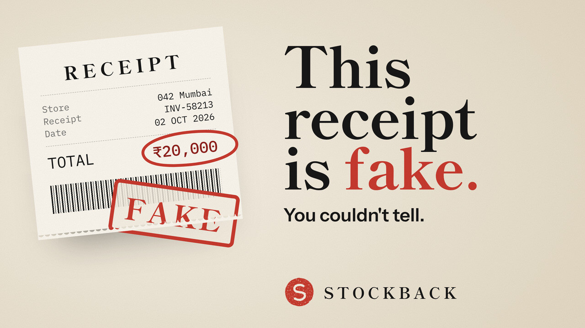</a>
</p>

A 2:30 film with a real claim settled on Robinhood Chain testnet ([tx `0x1fc40e3e…7afa97`](https://explorer.testnet.chain.robinhood.com/tx/0x1fc40e3e608da143515f62a81830072265914606311f56ec34ca7adfee7afa97)). Every frame, the score and the mix were made in code ([film/](film/README.md)).

## Built for every judging criterion

| Criterion | Evidence you can check |
|---|---|
| **Smart contract quality** | <ul><li>8 single-purpose Solidity contracts plus a Rust Stylus verifier: no proxies, no god contract, no admin over user funds.</li><li>**83 Foundry tests**, including 3 fuzz tests at 1,000 runs and 5 invariants (no replay, conservation, solvency, caps).</li><li>Every risk in [SECURITY.md](SECURITY.md) maps to a named test.</li><li>We also found and fixed a real router ABI mismatch in the upstream code, verified against deployed bytecode.</li></ul> |
| **Product-market fit** | <ul><li>The buyer is a brand losing money to forged receipts and paying coalition operators 10–30%.</li><li>The user gets ownership that can't expire or be devalued.</li><li>Launch markets are rail-first (Singapore PayNow, India UPI at 24B payments a month); the protocol itself is global.</li><li>We say plainly that there are no users or partners yet ([docs/RESEARCH.md](docs/RESEARCH.md)).</li></ul> |
| **Innovation** | <ul><li>Trust moves from pixels to a merchant signature, with an explicit evidence-tier model.</li><li>A nullifier independent of claimant, amount and deadline.</li><li>Rewards paid as admin-less ERC-4626 shares.</li><li>Ed25519 verified in Rust on Stylus at **9.2x less gas**, which fits 100 signatures per transaction where Solidity can't fit 53.</li></ul> |
| **Real problem solving** | <ul><li>People spot AI-edited receipts at chance (50.1%), and detectors barely beat it ([arXiv:2604.25213](https://arxiv.org/abs/2604.25213)).</li><li>STOCKBACK doesn't try to detect fakes; it removes the photo from the trust path.</li><li>Replay is blocked on-chain, and an attester-key leak has a closed-form loss bound ([whitepaper](whitepaper/STOCKBACK-Whitepaper.pdf), Prop. 2).</li></ul> |
| **USDG** | <ul><li>`USDGRewardAdapter` lets sponsors fund budgets in USDG, swapped through SwapRouter02 with oracle-bounded slippage and freshness checks.</li><li>It's live on testnet: [100 USDG → 10,000 mNKE into the Nike budget](https://explorer.testnet.chain.robinhood.com/tx/0x3d8de1490c0756b92e7e9a046419c1c14aa8913e4545a22171c2362715656c6d) (mock USDG on testnet).</li></ul> |
| **Robinhood Chain** | <ul><li>Every contract is deployed on Robinhood Chain testnet (46630), and the Stylus verifier is the registry's active verifier.</li><li>**13 real claims from 3 wallets** have settled, including the merchant-signed claim in the film.</li><li>Brand-vault shares are the on-chain form of the tokenized brand exposure Robinhood Chain is built for.</li></ul> |

## Introduction

Every purchase leaves evidence behind: a receipt, a UPI reference, an order email. Reward programs turn that evidence into points that expire, get devalued, and sit in one of the 15 programs you joined and forgot.

**STOCKBACK** changes two things:

1. **The trust origin.** The merchant's till signs every receipt field with Ed25519. STOCKBACK verifies that signature, not a photo, and checks it on-chain in Rust on **Arbitrum Stylus**.
2. **The reward.** A verified purchase becomes **shares of that brand's ERC-4626 vault**, held in your wallet. The vault has no admin, no pause and no sweep, so no one can dilute, freeze or expire your shares.

One transaction does it all: the registry verifies the claim, burns a per-receipt nullifier, applies eligibility, caps and a sponsor budget, then deposits into the vault in your name.

**Global protocol, rail-first launch.** Nothing in STOCKBACK is tied to one country:
- Every brand sets its own currency (an ISO-4217 code on-chain, so INR, SGD and USD all work) and its own amount bounds.
- Geography goes through a pluggable `IJurisdictionPolicy` adapter instead of hardcoded rules.
- Sponsors fund rewards in USDG, a dollar stablecoin.

We launch where every payment already carries a digital merchant trail, which is exactly where merchant-signed receipts plug in:
- **Singapore**, through PayNow and SGQR
- **India**, through UPI

The live demo is priced in INR for that reason.

## The problem

<p align="center">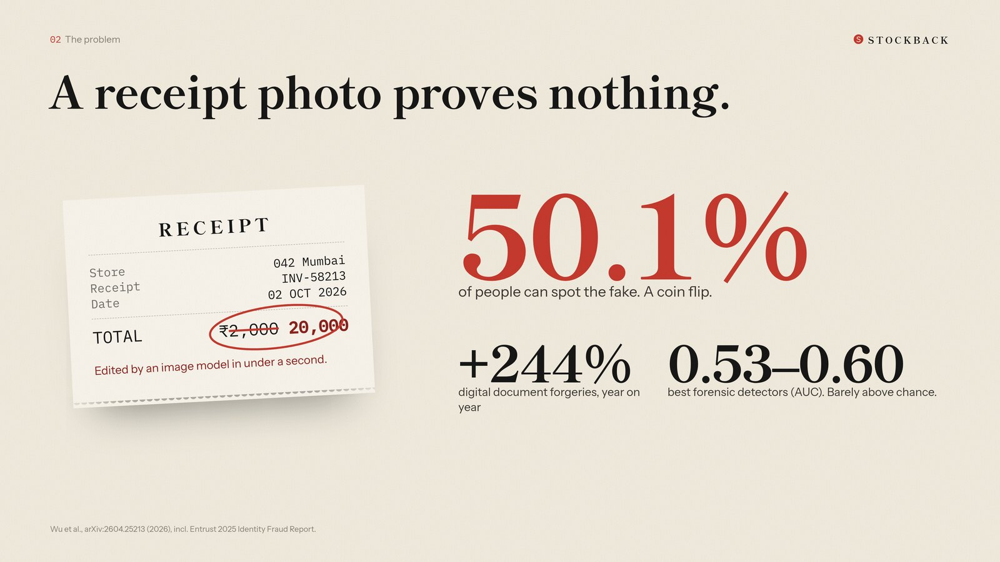</p>

**A receipt photo is no longer evidence.**
- In a 2026 paired study, people picked an AI-edited receipt over its authentic twin **50.1%** of the time, which is chance.
- The best forensic detectors reached an AUC of only **0.53–0.60** ([Wu et al., arXiv:2604.25213](https://arxiv.org/abs/2604.25213)).
- Digital document forgeries rose **244%** year on year (Entrust 2025, cited there).

Any reward, refund or warranty flow that trusts pixels is paying out on fakes.

<p align="center">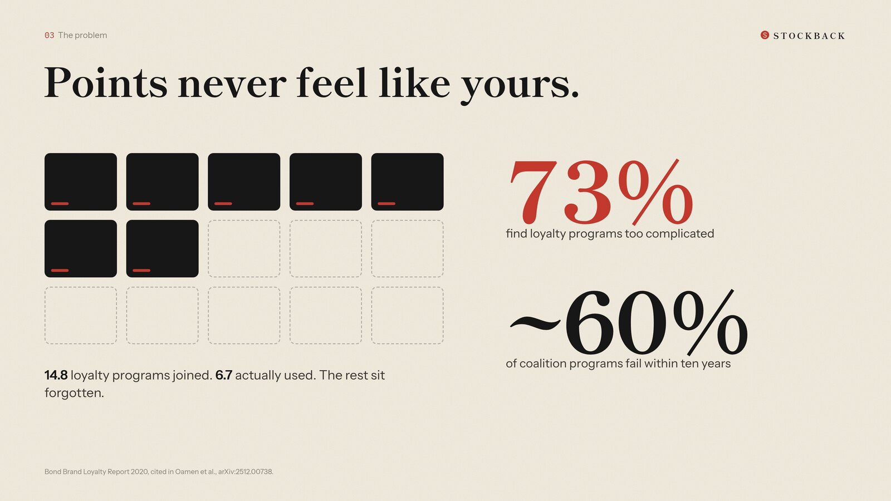</p>

**Points never feel like yours.**
- People belong to **14.8** loyalty programs and use **6.7**.
- **73%** find loyalty programs too complicated.
- About **60%** of coalition programs fail within ten years.

Operators can also expire or devalue balances at will (Bond Loyalty Report 2020, via [arXiv:2512.00738](https://arxiv.org/abs/2512.00738)).

## The painkiller

<p align="center">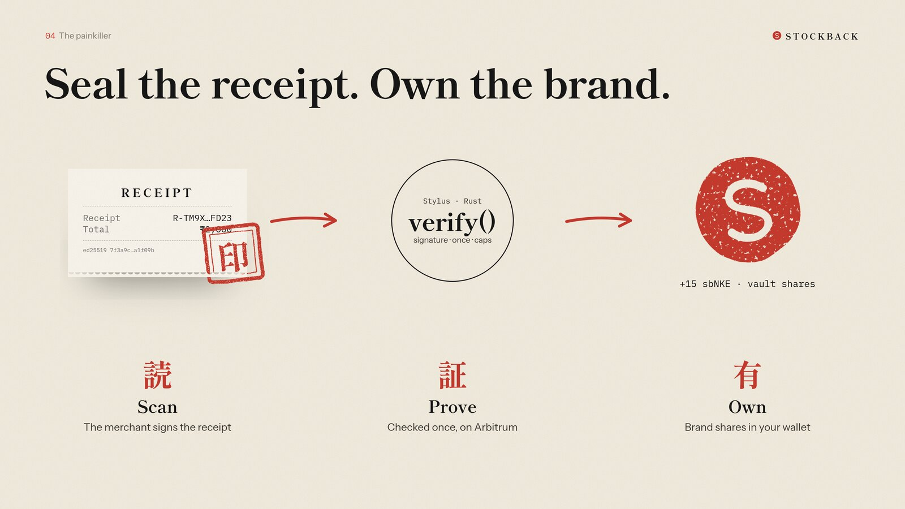</p>

| | Step | What happens |
|---|---|---|
| 読 | **Scan** | The merchant's till signs the receipt. You scan its QR. No photo needs to be trusted. |
| 証 | **Prove** | The signature is checked, the receipt counts once, and Stylus verifies the claim on-chain. |
| 有 | **Own** | You receive shares of that brand's vault. No admin can dilute, freeze or expire them. |

## What makes it different

<p align="center">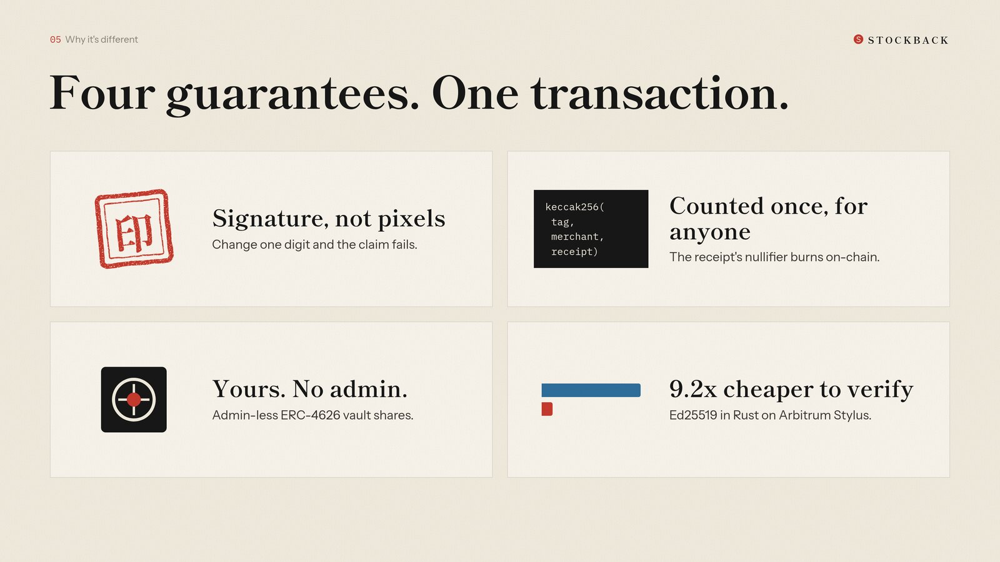</p>

| Guarantee | How | Where |
|---|---|---|
| **Signature, not pixels** | The till signs 8 fields (merchant, brand, receipt ID, amount, currency, issue, expiry). Change one digit and the claim fails. | `web/lib/merchant-pos.mjs`, `web/app/api/attest` |
| **Counted once, for anyone** | `nullifier = keccak256(tag, merchantId, receiptHash)`, independent of claimant, amount and deadline, burned on-chain | `src/PurchaseClaim.sol`, `ReceiptCommitmentRegistry` |
| **Yours, no admin** | One ERC-4626 vault per brand, with no owner, pause or sweep. `_decimalsOffset = 6` blocks inflation attacks. | `src/BrandVault.sol` |
| **9.2x cheaper to verify** | Strict Ed25519 in Rust on Stylus, behind the same `verify(bytes32,bytes)` ABI as the Solidity verifier | `stylus/receipt-prover` |

**The vault is not the moat. The moat is the verification and eligibility pipeline** that connects an off-chain purchase to an on-chain ownership allocation, with every key's authority bounded.

## Product tour

Real screenshots of the live app at [stockbacks.vercel.app](https://stockbacks.vercel.app), on Robinhood Chain testnet.

<table>
  <tr>
    <td width="50%">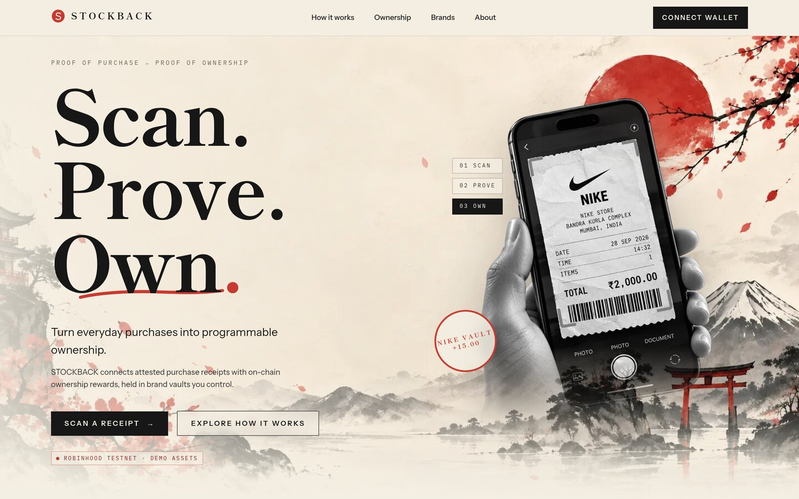<br><sub><b>Landing</b>: live claim feed read from chain events</sub></td>
    <td width="50%">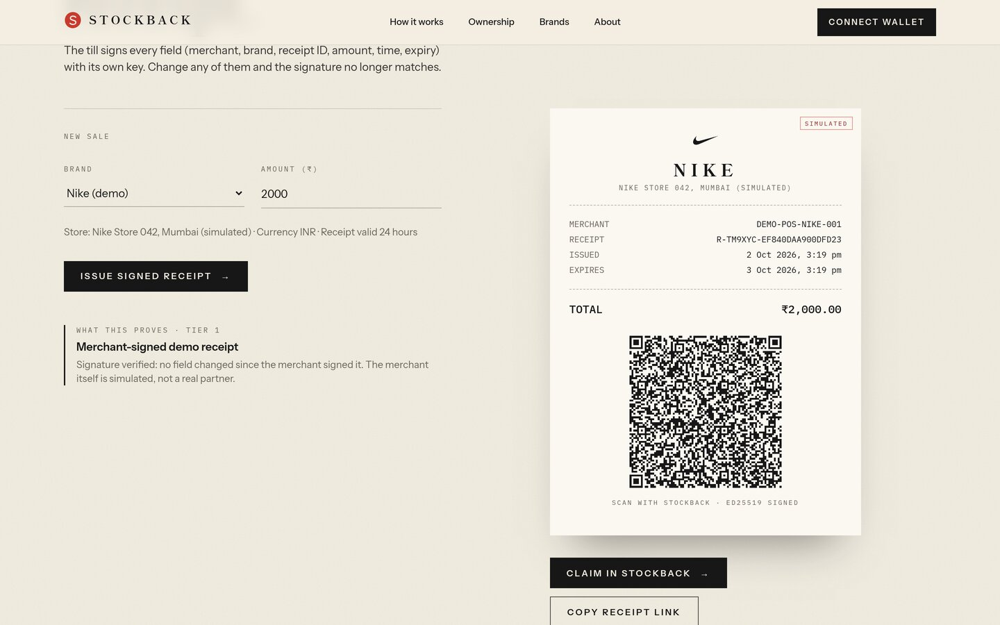<br><sub><b>Merchant POS</b> (simulated): rings up a sale, prints an Ed25519-signed receipt QR</sub></td>
  </tr>
  <tr>
    <td>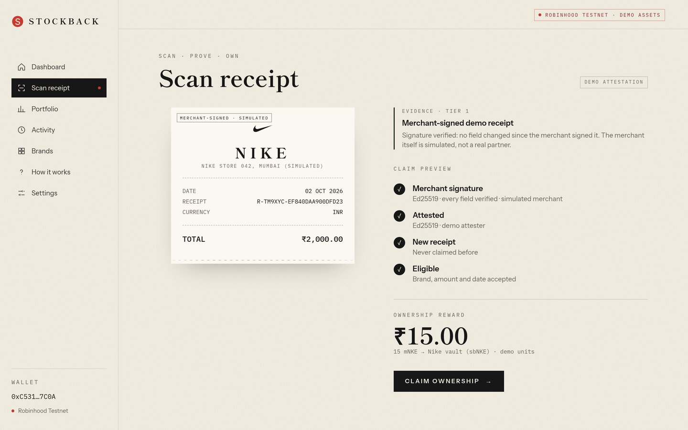<br><sub><b>Verify</b>: merchant signature, attestation, new receipt and eligibility, all checked before the wallet opens</sub></td>
    <td>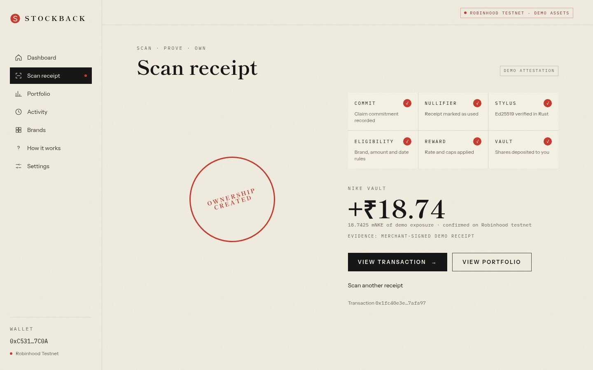<br><sub><b>Ownership created</b>: Stylus verified the claim in one transaction</sub></td>
  </tr>
  <tr>
    <td>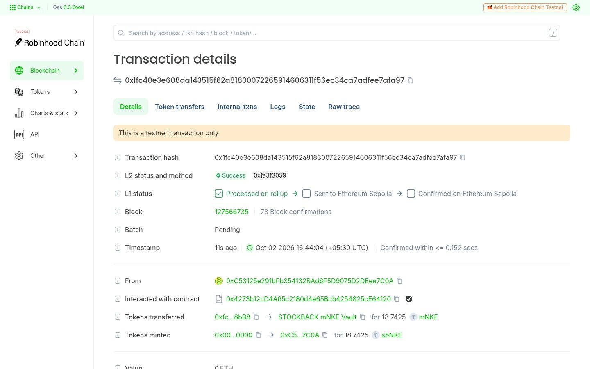<br><sub><b>On-chain</b>: Success, 18.7425 sbNKE minted to the wallet</sub></td>
    <td>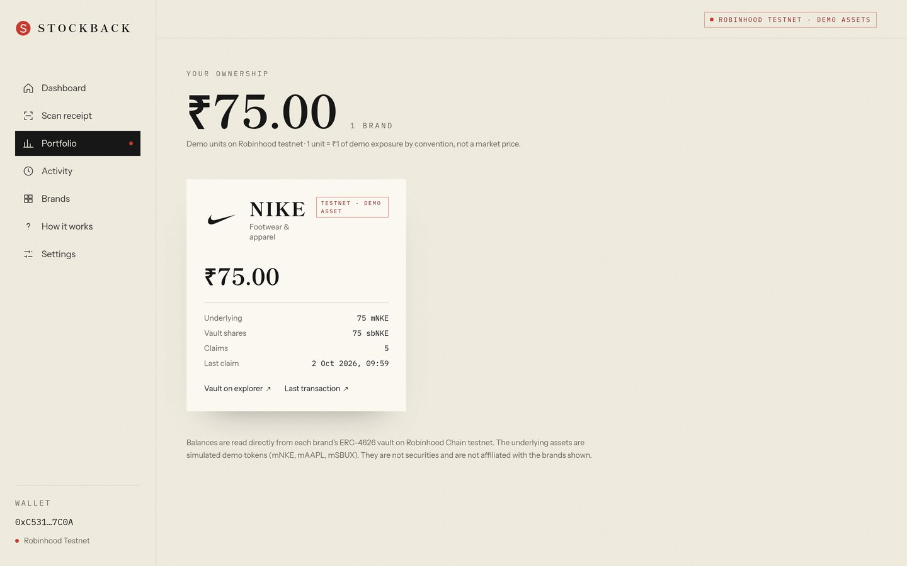<br><sub><b>Portfolio</b>: vault positions read live from each ERC-4626 vault</sub></td>
  </tr>
  <tr>
    <td colspan="2" align="center">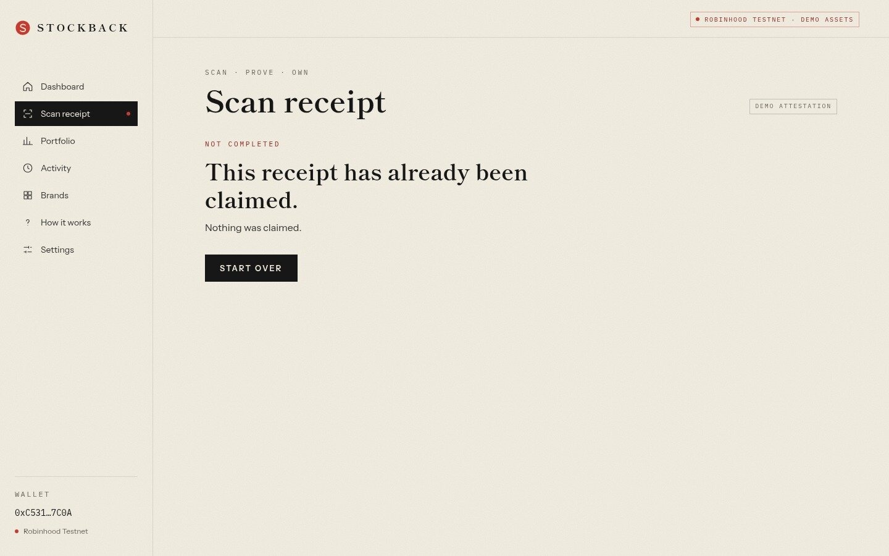<br><sub><b>Replay rejected</b>: the same receipt, any wallet, is refused</sub></td>
  </tr>
</table>

## Architecture

<p align="center">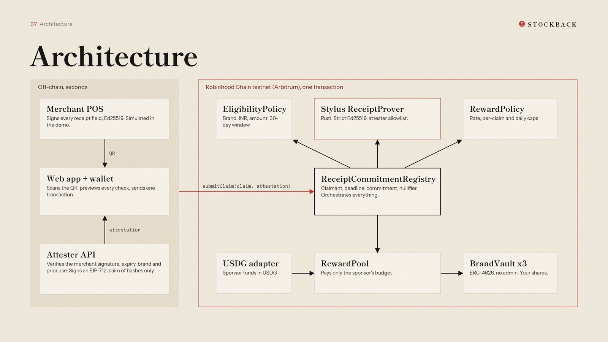</p>

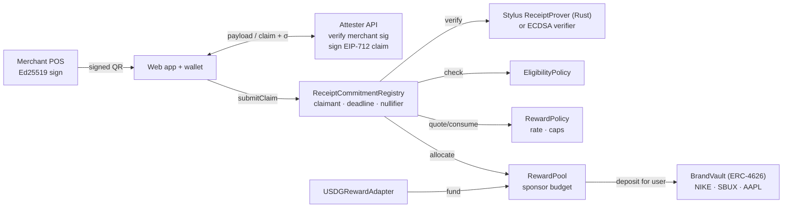
```mermaid
flowchart LR
    POS["Merchant POS<br/>Ed25519 sign"] -->|signed QR| APP["Web app + wallet"]
    APP <-->|payload / claim + σ| ATT["Attester API<br/>verify merchant sig<br/>sign EIP-712 claim"]
    APP -->|submitClaim| REG["ReceiptCommitmentRegistry<br/>claimant · deadline · nullifier"]
    REG -->|verify| V["Stylus ReceiptProver (Rust)<br/>or ECDSA verifier"]
    REG -->|check| E["EligibilityPolicy"]
    REG -->|quote/consume| P["RewardPolicy<br/>rate · caps"]
    REG -->|allocate| POOL["RewardPool<br/>sponsor budget"]
    USDG["USDGRewardAdapter"] -->|fund| POOL
    POOL -->|deposit for user| BV["BrandVault (ERC-4626)<br/>NIKE · SBUX · AAPL"]
```

| Layer | Component | Responsibility |
|---|---|---|
| Evidence | `web/app/api/merchant/receipt` (simulated POS) | Sign a receipt with the demo merchant Ed25519 key and print it as a QR |
| Evidence | `web/app/api/attest`, `tools/attester.mjs` | Verify the merchant signature (tier 1) or take user-confirmed fields (tier 2); hash identifiers with a secret salt; sign the EIP-712 claim |
| Proof | `ReceiptCommitmentRegistry` | Claimant binding, deadline, commitment, nullifier, orchestration, pause |
| Proof | `stylus/receipt-prover` / `ECDSAAttestationVerifier` | Yes or no: did an allowlisted attester sign exactly this claim? |
| Eligibility | `EligibilityPolicy` (+ `IJurisdictionPolicy`) | Brand active, currency, amount bounds (₹100–₹5,00,000), purchase within 30 days, optional KYC/region gate |
| Eligibility | `RewardPolicy` | `reward = amount × rate × multiplier`; per-claim, daily-user and daily-brand caps (caps reject, they don't clip) |
| Ownership | `RewardPool` | Sponsor-funded budget per brand; pays only what was deposited |
| Ownership | `BrandVaultFactory`, `BrandVault` | One admin-less ERC-4626 vault per brand (CREATE2, salt = brandId) |
| Funding | `USDGRewardAdapter` | Optional: fund the budget in USDG, swapped to the brand asset with oracle-bounded slippage (SwapRouter02) |

<p align="center">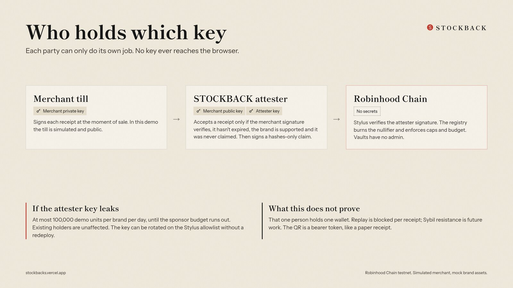</p>

**Trust boundary:**
- The till holds the merchant private key.
- The attester holds only the merchant **public** key plus its own key.
- The chain holds no secrets.
- No key ever reaches the browser; `npm run check:secrets` verifies the client bundle.

More diagrams are in **[docs/ARCHITECTURE.md](docs/ARCHITECTURE.md)**.

## Workflows

### 1. From receipt to ownership

<p align="center">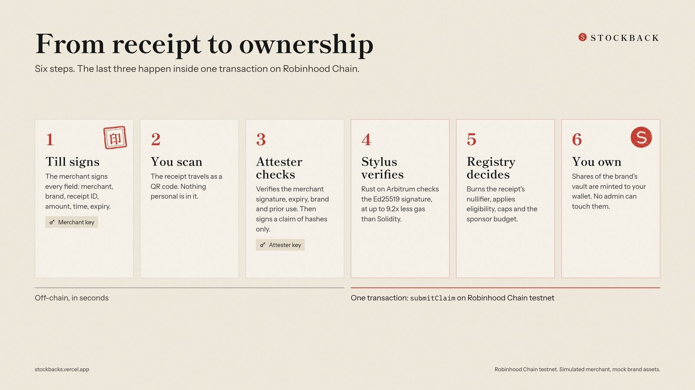</p>

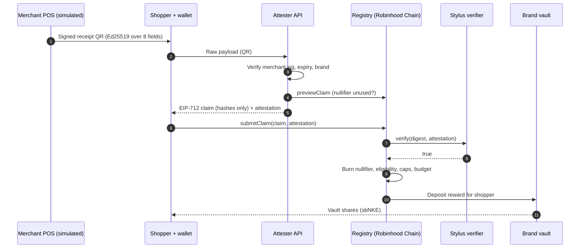
```mermaid
sequenceDiagram
    autonumber
    participant M as Merchant POS (simulated)
    participant U as Shopper + wallet
    participant A as Attester API
    participant R as Registry (Robinhood Chain)
    participant S as Stylus verifier
    participant V as Brand vault
    M->>U: Signed receipt QR (Ed25519 over 8 fields)
    U->>A: Raw payload (QR)
    A->>A: Verify merchant sig, expiry, brand
    A->>R: previewClaim (nullifier unused?)
    A-->>U: EIP-712 claim (hashes only) + attestation
    U->>R: submitClaim(claim, attestation)
    R->>S: verify(digest, attestation)
    S-->>R: true
    R->>R: Burn nullifier, eligibility, caps, budget
    R->>V: Deposit reward for shopper
    V-->>U: Vault shares (sbNKE)
```

### 2. Inside the one claim transaction

<p align="center">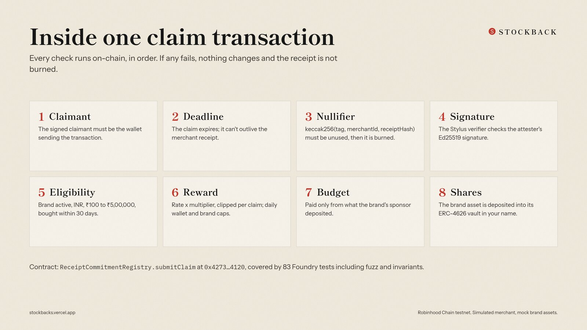</p>

Every check runs on-chain, in order. If any fails, nothing changes and the receipt is not burned. `previewClaim` returns exactly the status `submitClaim` would revert with, so the UI explains a rejection before the wallet opens.

### 3. The live demo, step by step

<p align="center">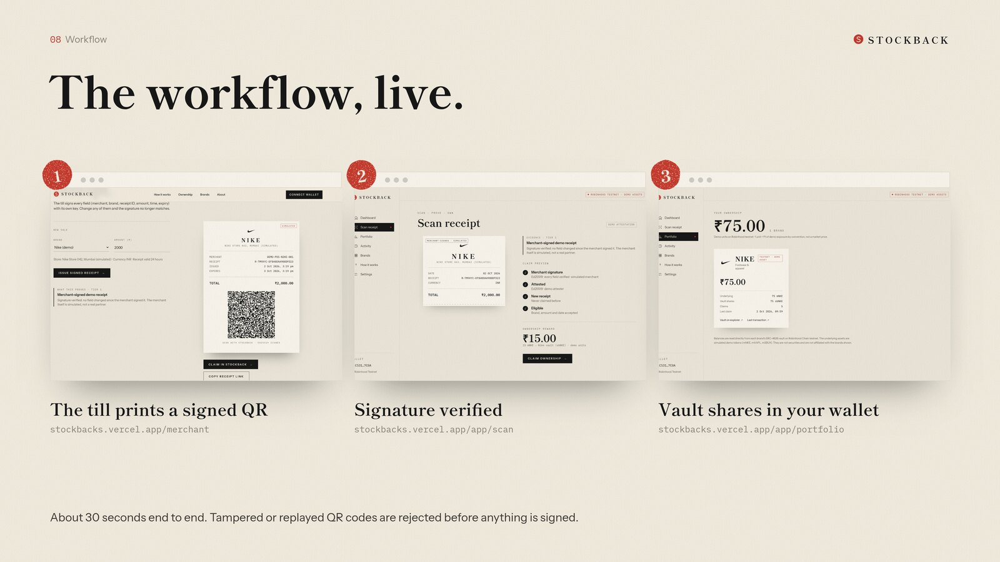</p>

1. Open **[/merchant](https://stockbacks.vercel.app/merchant)**, pick a brand and amount, then **Issue signed receipt**.
2. Scan the QR with a phone, or press **Claim in STOCKBACK**.
3. Connect a wallet on Robinhood Chain testnet, then **Verify signature**: merchant signature ✓, attested ✓, new receipt ✓, eligible ✓.
4. **Claim ownership**. One transaction, verified by Stylus. **View transaction** shows it on the explorer.
5. Open the same QR again: *"This receipt has already been claimed."* Edit any field in the link: *"The merchant signature doesn't match."*

## Evidence tiers

<p align="center">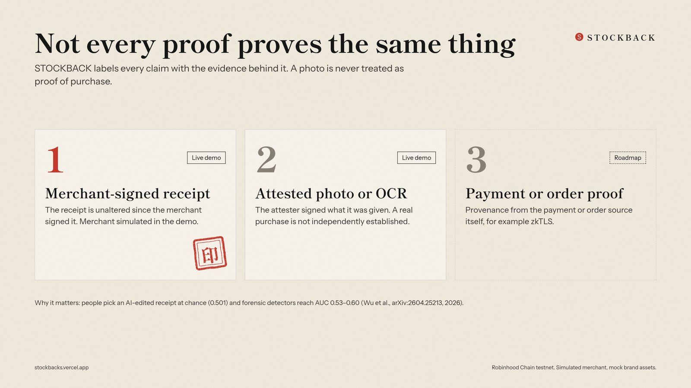</p>

The on-chain path is identical for every claim. What differs is what the attester checked before signing, and the app labels it on every screen.

| Tier | Evidence | Establishes | Status |
|---|---|---|---|
| 1 | **Merchant-signed receipt** | The receipt is unaltered since the merchant key signed it. Merchant simulated in the demo. | Live demo |
| 2 | **Attested photo / OCR** | Only that the attester signed what it was given; authenticity is **not** established | Live demo |
| 3 | **Verified payment / order evidence** (zkTLS) | Provenance from the payment or order source itself | Roadmap |

## Stylus benchmark

<p align="center">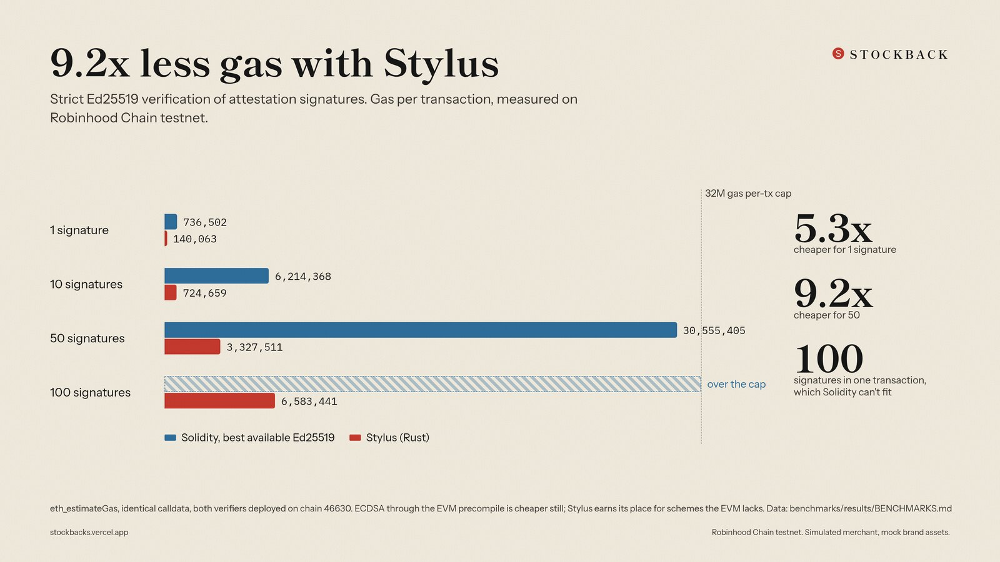</p>

Strict Ed25519 verification of attestation signatures, measured on **Robinhood Chain testnet** with `eth_estimateGas` and byte-identical calldata:

| Batch | Solidity Ed25519 | Stylus Ed25519 | Solidity ÷ Stylus |
|---:|---:|---:|---:|
| 1 | 736,502 gas | 140,063 gas | 5.3× |
| 10 | 6,214,368 gas | 724,659 gas | 8.6× |
| 50 | 30,555,405 gas | 3,327,511 gas | 9.2× |
| 100 | exceeds the 32M per-tx cap | 6,583,441 gas | n/a |

- **Marginal cost:** about 608k gas per signature in Solidity against about 65k in Stylus.
- **Capacity:** 100 signatures fit in one transaction with Stylus; Solidity can't fit 53.
- **ECDSA** through the EVM precompile is cheaper still, so Stylus earns its place for schemes the EVM lacks.

Methodology: **[benchmarks/results/BENCHMARKS.md](benchmarks/results/BENCHMARKS.md)**. The fitted gas model is in the **[whitepaper](whitepaper/STOCKBACK-Whitepaper.pdf)**.

## Market gap

<p align="center">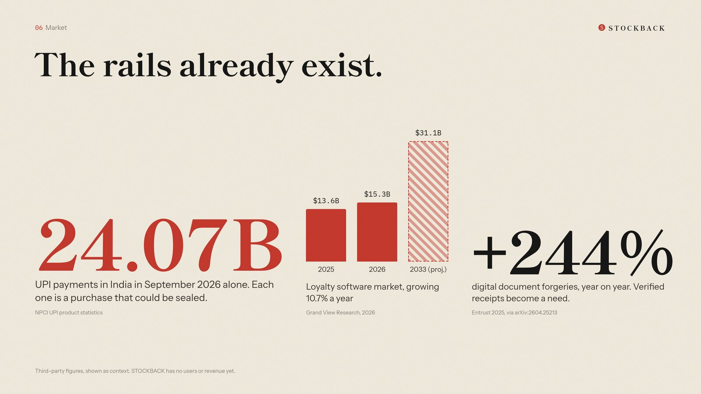</p>

| What exists | What's missing | STOCKBACK |
|---|---|---|
| **Receipt-scanning cashback apps** reward a photo | A photo proves nothing now: humans spot fakes at chance, detectors barely do better | Trust moves to a merchant signature, labelled by evidence tier |
| **Loyalty points** (closed or coalition) | Points expire, get devalued, and are locked to one program; coalitions take a 10–30% cut and hold brand data | Admin-less ERC-4626 vault shares per brand, with no operator in the middle |
| **Crypto cashback** pays unrelated tokens | No proof the purchase happened, or happened once | One nullifier per receipt, enforced on-chain |
| **zkTLS / web proofs** (DECO, TLSNotary) | Not yet wired into rewards | A tier-3 slot already designed into the evidence model |

The rails already exist: India alone processed **24.07 billion UPI payments in September 2026** (NPCI), and Singapore's PayNow and SGQR carry the same kind of merchant trail. The loyalty-management market is **$15.3B in 2026**, projected to reach **$31.1B by 2033** (Grand View Research). These are third-party figures for context; STOCKBACK has no users or revenue yet.

Deeper analysis with citations: **[docs/RESEARCH.md](docs/RESEARCH.md)**.

## Security, privacy and limits

- **Anti-replay:** `nullifier = keccak(tag, merchantId, receiptHash)`. The same receipt cannot be claimed twice, even with a different claimant, amount, brand or deadline.
- **Anti-front-running:** the claimant is signed and must be `msg.sender`.
- **Domain separation:** EIP-712 over the chain ID and registry address. Cross-chain and cross-deployment replays are tested.
- **Merchant signatures (tier 1):** every field is signed. Tampering, a wrong key, expiry, unsupported brands and already-used receipts are rejected before the attester signs. The demo POS is public, so this shows the mechanism, not fraud resistance.
- **Bounded authority:** the verifier only returns a bool, only the registry spends budget, and vault assets are unreachable by any admin. An attester-key leak is bounded by the per-brand daily cap (100,000 demo units) and the budget. The key can be rotated on the Stylus allowlist without a redeploy.
- **Sybil resistance (partial):** nullifiers stop receipt replay, **not** multi-wallet farming. Rewards attach to receipts, not identities.
- **Privacy:** raw receipts, UPI IDs, names and phones never go on-chain, and receipt hashes are salted. Amount, merchant hash and time are public ([docs/PRIVACY.md](docs/PRIVACY.md)).
- **Not built yet:** a hold period with refund voiding. Rewards settle instantly.

The full checklist maps every risk to the test that covers it: **[SECURITY.md](SECURITY.md)**.

**Tests:**
- 83 Foundry tests: unit, integration, 3 fuzz tests at 1,000 runs and 5 invariants
- 5 Rust tests over 100 shared vectors
- 20 receipt-signing unit tests
- 22 live-testnet integration checks
- an 11-step browser suite
- a secret-leak scan

## Live on Robinhood Chain testnet (46630)

| Contract | Address |
|---|---|
| ReceiptCommitmentRegistry | [`0x4273b12cD4A65c2180d4e65Bcb4254825cE64120`](https://explorer.testnet.chain.robinhood.com/address/0x4273b12cD4A65c2180d4e65Bcb4254825cE64120) |
| Stylus ReceiptProver (active verifier) | [`0x9ae8a390121ba71545e9923b333d60e7e3ccd3bd`](https://explorer.testnet.chain.robinhood.com/address/0x9ae8a390121ba71545e9923b333d60e7e3ccd3bd) |
| ECDSAAttestationVerifier | `0x3d2F146142387654B8118952e38ac87aA492879A` |
| EligibilityPolicy | `0x2511F246623feFB12b1eb10B0aA3871E9595a2Cf` |
| RewardPolicy | `0x687F2903D0F8A85A6a47F84013423EC5e47353Fa` |
| RewardPool | `0xfcd0Db816184AF3bdf3Fa617E1bCDB5D6c638bB8` |
| BrandVaultFactory | `0xA8ee8029F57e5251aCEbEcD96B6aB3E345BeBA5b` |
| USDGRewardAdapter | `0xe8CDb2525eE30140f3344f2D18BAe312b1336961` |
| sbNKE / sbSBUX / sbAAPL vaults | `0x01650440F92F1A70d74a67F2da72370d34fC43b4` / `0xc5564C4209A3627E0c6e851884A1F01FA3aAC4BC` / `0x3979865D7963b9eb84183dcd9DC4024C04b3bd22` |

**Real transactions:**

- Sponsor funds the Nike budget in USDG through the adapter: [`0x3d8de149…6c6d`](https://explorer.testnet.chain.robinhood.com/tx/0x3d8de1490c0756b92e7e9a046419c1c14aa8913e4545a22171c2362715656c6d) (100 USDG → 10,000 mNKE)
- Merchant-signed receipt claimed on film, Stylus-verified: [`0x1fc40e3e…7afa97`](https://explorer.testnet.chain.robinhood.com/tx/0x1fc40e3e608da143515f62a81830072265914606311f56ec34ca7adfee7afa97) (18.7425 sbNKE)
- Merchant-signed receipt, browser test: [`0xabd3b62b…5388`](https://explorer.testnet.chain.robinhood.com/tx/0xabd3b62b5ef8f02d5f8226c54ee237be9080b57c9b1bdf2529252279a30c5388)
- Apple ₹14,990 claim, Ed25519 verified in Stylus: [`0x7fe2a51a…d9c4`](https://explorer.testnet.chain.robinhood.com/tx/0x7fe2a51a5567bec1b96e2fa389c959368fbeda7a05bacc98c3383f544fc8d9c4) (74.95 mAAPL)
- Registry switched to the Stylus verifier: [`0xdef1f321…c324`](https://explorer.testnet.chain.robinhood.com/tx/0xdef1f3214a7aae35a2b8b970aaf8276a1aae29ba8d3f873b7278f436a784c324)

All brand assets and USDG here are **mocks**. Full list: [`deployments/46630.json`](deployments/46630.json).

## FAQ

**Is STOCKBACK India-only?** No.
- Currency is set per brand, jurisdiction is an adapter, and rewards are funded in USDG.
- The demo uses INR because we launch on payment rails that already carry a merchant trail: Singapore (PayNow/SGQR) first, then India (UPI).
- Launching a brand in SGD or USD is one `setBrandRules` call, not a redeploy.

**Is the merchant real?** No. The point-of-sale in the demo is simulated, and its key is a demo key. In production the key lives inside the merchant's POS or HSM.

**Are the brand shares securities?** No. Every brand asset on testnet is a labelled mock. Issuer-authorized assets would sit behind the jurisdiction adapter ([docs/COMPLIANCE.md](docs/COMPLIANCE.md)).

**What if someone copies a receipt QR?** It's a bearer token, like a paper receipt: the first wallet to claim it wins, and every later attempt is rejected on-chain. Copying an *attestation* is useless, because the claimant is signed and must equal `msg.sender`.

## Quickstart

Requires [Foundry](https://book.getfoundry.sh), Node ≥ 20, and for Stylus: Rust (toolchain pinned in `stylus/receipt-prover/rust-toolchain.toml`) and `cargo-stylus`.

```bash
forge install --no-git foundry-rs/forge-std@6e8c4a92c9a8b31c1b0f0c39296d1fa4695c7df8 \
  OpenZeppelin/openzeppelin-contracts@69c8def5f222ff96f2b5beff05dfba996368aa79

forge build && forge test                        # 83 tests: unit, fuzz, invariant
forge test --root benchmarks/solidity -vv        # Solidity Ed25519 baseline + gas table
(cd stylus/receipt-prover && cargo test)         # Stylus verifier tests

anvil &                                          # local end-to-end demo
script/demo.sh
```

**Web app:**

```bash
cd web && cp .env.example .env.local && npm install
npm run dev                                      # http://localhost:3000
npm test && npm run typecheck && npm run lint
npm run test:e2e                                 # live-testnet integration checks
```

See **[web/README.md](web/README.md)** for env vars and the merchant-receipt flow.

### Deploy to Robinhood Chain testnet

```bash
cp .env.example .env    # fill DEPLOYER_PRIVATE_KEY, ATTESTER_ADDRESS (faucet: https://faucet.testnet.chain.robinhood.com/)
set -a; . ./.env; set +a
forge script script/DeployStockback.s.sol --rpc-url "$RPC_URL" --broadcast --slow
# optional: Stylus verifier as the active verifier
# note: --constructor-args is variadic, keep it last
(cd stylus/receipt-prover && cargo stylus deploy -e "$RPC_URL" --private-key "$DEPLOYER_PRIVATE_KEY" --no-verify --constructor-args <owner>)
```

The demo deploy script refuses any chain other than 31337, 46630 and 421614, and writes all addresses to `deployments/<chainId>.json`.

## Repository

```
src/                      Solidity protocol (8 contracts) + interfaces + labelled mocks
stylus/receipt-prover/    Rust/Stylus Ed25519 attestation verifier
test/                     Foundry unit / fuzz / invariant / integration / security tests
script/                   DeployStockback.s.sol, demo.sh
tools/attester.mjs        Demo attester CLI (shares web/lib/attester-core.mjs)
web/                      Consumer web app (Next.js, RainbowKit, live testnet)
benchmarks/               Solidity-vs-Stylus harness, fixtures, results
whitepaper/               11-page technical whitepaper (LaTeX + PDF)
brand/                    Brand system, posters, deck, thumbnails (rendered from code)
film/                     The 2:30 demo film: recorder, motion design, score, mix
config/ deployments/      Network registry, deployment outputs
docs/                     ARCHITECTURE, RESEARCH, PRIVACY, COMPLIANCE, HACKATHON, MIGRATION_AUDIT, …
```

## Roadmap

| | Item |
|---|---|
| **Implemented** | Merchant-signed receipts (simulated merchant), photo/OCR attestation, per-receipt nullifier, caps and budgets, Stylus Ed25519 verification, admin-less vaults, USDG funding adapter |
| **Next** | A pending period with void-on-refund (needs new contracts; rewards currently settle instantly); real merchant keys inside a POS or HSM, plus a merchant key registry and revocation; attester rotation runbook and k-of-n attesters; stronger Sybil resistance; multisig and timelock on configuration; gasless claim relaying |
| **Later** | Tier 3: payment/order-source proofs (zkTLS); amount privacy; batch claims; issuer-authorized assets behind the jurisdiction adapter |

**Not claimed:** merchant partnerships, users, traction, or measured fraud reduction or retention effects. None exist yet.

The mapping to the judging criteria (contract quality, product-market fit, innovation, real problem solving, USDG, Robinhood Chain) is in **[docs/HACKATHON.md](docs/HACKATHON.md)**.

## License and attribution

MIT (see [LICENSE](LICENSE)). This repository started from **[Wield](https://github.com/useWield/wield-contracts)** (MIT, © 2026 Wield).

- **Adapted from Wield:**
  - Foundry setup and CI
  - the oracle freshness and slippage checks and chain-id guards (now in `USDGRewardAdapter` and the deploy script)
  - `IAggregatorV3`, `ISwapRouter` (corrected to SwapRouter02), and `MockUSDG` / `MockAggregatorV3`
- **Original STOCKBACK work:** the claim model, registry, verifiers (Solidity and Stylus), policies, reward pool, brand vault and factory, attester, merchant receipts, web app, benchmark, whitepaper, brand and film.
- **Not included:** Wield's vault, basket and P2P contracts; see [docs/MIGRATION_AUDIT.md](docs/MIGRATION_AUDIT.md).
- **Vendored:** the benchmark baseline uses [chengwenxi/Ed25519](https://github.com/chengwenxi/Ed25519) (Apache-2.0) under `benchmarks/solidity/src/vendor/`.

<p align="center"><br><br><b>Scan. Prove. Own.</b></p>
