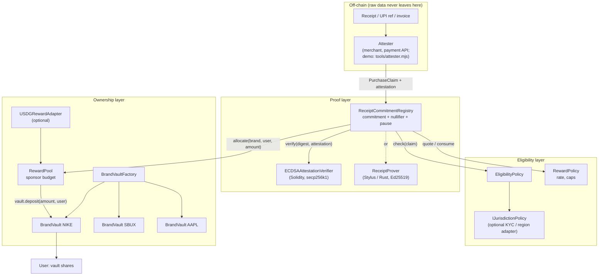
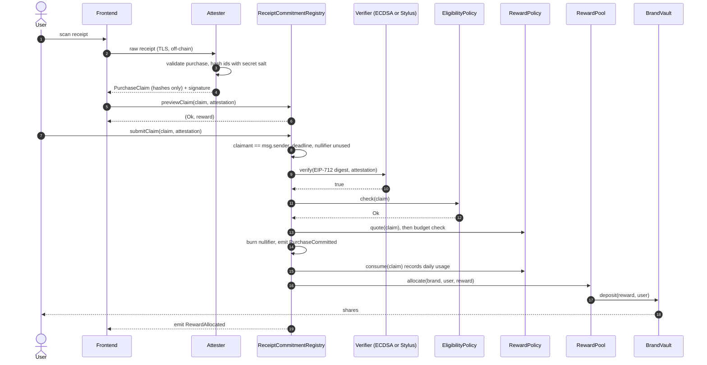
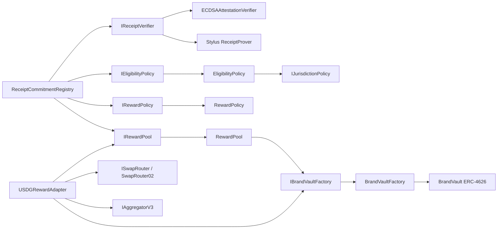
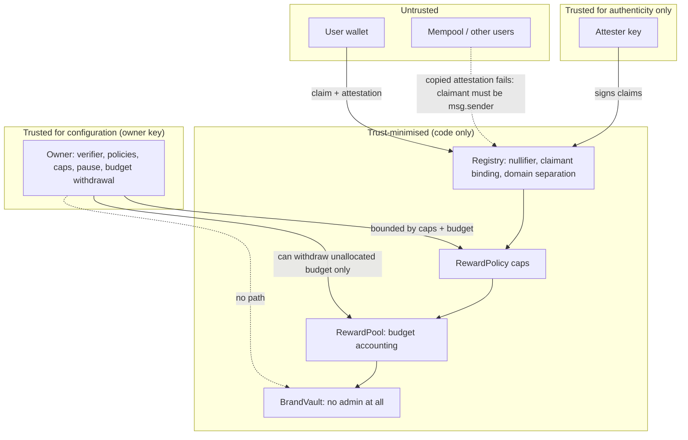
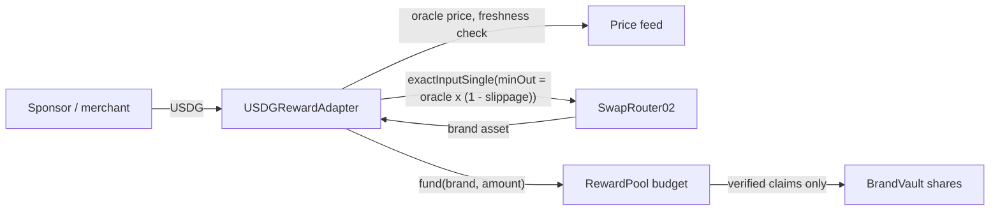
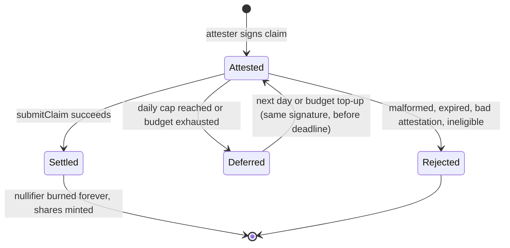

# Architecture

STOCKBACK has four layers with one-way dependencies: **Evidence → Proof → Eligibility → Ownership**.

## 1. System architecture



## 2. Purchase-to-ownership sequence



## 3. Contract dependencies

Arrows point from caller to callee. There are no cycles. The only contract that can spend budget or record cap usage is the registry.



## 4. Trust boundaries



What each party can do in the worst case:

| Compromised party | Worst case | Bound |
|---|---|---|
| Attester key | Sign fake purchases | Per-claim, daily-user and daily-brand caps; unallocated budget; owner can revoke the attester |
| Verifier contract | Say "valid" to anything | Same caps and budget; cannot move funds or change config |
| Owner key | Swap verifier or raise caps, withdraw **unallocated** budget | Cannot touch vault assets or user shares |
| User | Replay, alter or front-run claims | Nullifier, signature over all fields, claimant binding |

## 5. USDG reward flow (optional adapter)



`Reward Budget = Merchant Funding (+ any future yield contribution)`. No yield source is integrated or assumed.

## 6. Claim lifecycle

On-chain, a claim is atomic. It is either rejected, which reverts with `ClaimRejected(status)` and leaves no state behind, or it settles. A receipt rejected for a cap or budget reason can be resubmitted later because its nullifier was never burned.



## Economics (deterministic, integer-only)

```
reward = amount_minor_units × rateWad / 1e18 × multiplierBps / 10_000        (512-bit mulDiv)
reward = min(reward, perClaimCap)
require userIssued[brand][user][day]  + reward ≤ dailyUserCap
require brandIssued[brand][day]       + reward ≤ dailyBrandCap
require pool.budgetOf(brand)          ≥ reward
```

`rateWad` is a sponsor-set conversion ("brand-asset units per rupee"), in the same spirit as airline miles per rupee. It is not a market price. Config bounds: `multiplierBps ≤ 30_000`, `perClaimCap ≤ dailyUserCap ≤ dailyBrandCap`.

Demo parameters are in `script/DeployStockback.s.sol`: NIKE 0.75%, SBUX 1%, AAPL 0.5%, a per-claim cap of 100 units, a daily user cap of 300, and a daily brand cap of 100,000. 1e18 mock units stand for ₹1 of fictional demo exposure.
