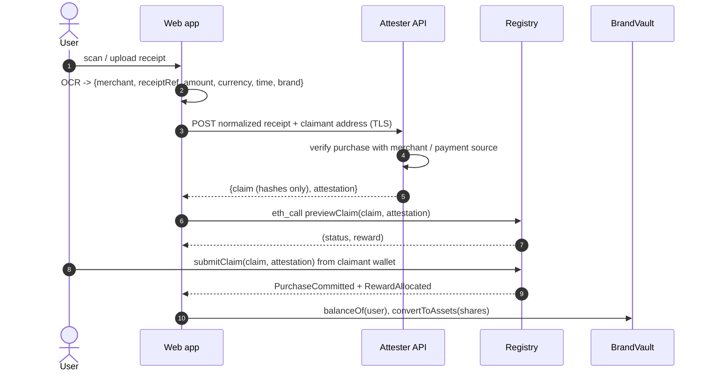

# Frontend Integration

The contracts are frontend-agnostic. The production client is **`web/`** (see `web/README.md`); `script/demo.sh` is a CLI reference client that performs the same steps with `cast` and `tools/attester.mjs`. Addresses come from `deployments/<chainId>.json`.

## Flow



| # | Step | Where | Contract call / data |
|---|---|---|---|
| 1 | User scans or uploads the receipt | device | Image stays on the device or goes only to the attester |
| 2 | OCR produces a normalized receipt | device or attester | `{merchant, receiptRef, amount (minor units), currency, purchasedAt, brand}` |
| 3 | Attestation | attester | Hashes `merchantId`, salted `receiptHash`; signs the EIP-712 digest (ECDSA 65 B or Ed25519 96 B) |
| 4 | Commitment | attester / app | `claimId = registry.claimId(claim)` (EIP-712 struct hash) |
| 5 | Preview | app | `registry.previewClaim(claim, att)` returns `(ClaimStatus, reward)`. Show ✓ Attested, ✓ New receipt, ✓ Eligible, reward |
| 6 | User submits | wallet | `registry.submitClaim(claim, att)`, where `msg.sender` must equal `claim.claimant` |
| 7 | Registry records commitment + nullifier | chain | `PurchaseCommitted` event |
| 8 | Verifier validates | chain | ECDSA verifier, or the Stylus `ReceiptProver` if configured |
| 9 | Eligibility evaluates | chain | `EligibilityPolicy.check` |
| 10 | Reward calculated | chain | `RewardPolicy.quote` / `consume` |
| 11 | Brand vault receives the allocation | chain | `RewardPool.allocate` → `BrandVault.deposit(reward, user)` |
| 12 | Portfolio | app | For each `factory.brandIds(i)`: `vault = factory.vaultOf(id)`, `shares = vault.balanceOf(user)`, `value = vault.convertToAssets(shares)` |

## ABI essentials

```solidity
struct PurchaseClaim { address claimant; bytes32 brandId; bytes32 merchantId; bytes32 receiptHash;
                       uint128 amount; bytes3 currency; uint64 purchasedAt; uint64 deadline; }
function previewClaim(PurchaseClaim c, bytes att) view returns (uint8 status, uint256 reward);
function submitClaim(PurchaseClaim c, bytes att) returns (bytes32 claimId, uint256 shares);
error ClaimRejected(uint8 status);
```

EIP-712 domain: `{ name: "STOCKBACK", version: "1", chainId, verifyingContract: registry }`.
Type: `PurchaseClaim(address claimant,bytes32 brandId,bytes32 merchantId,bytes32 receiptHash,uint128 amount,bytes3 currency,uint64 purchasedAt,uint64 deadline)`.

`ClaimStatus` codes (UI copy):

| # | Status | Suggested message |
|---|---|---|
| 0 | Ok | Eligible |
| 1 | Malformed | Receipt could not be read |
| 2 | WrongClaimant | Connect the wallet this receipt was issued to |
| 3 | Expired | Attestation expired, rescan |
| 4 | NullifierUsed | This receipt was already claimed |
| 5 | BadAttestation | Receipt could not be verified |
| 6 | BrandInactive | Brand not supported yet |
| 7 | CurrencyMismatch | Currency not supported for this brand |
| 8 | AmountOutOfRange | Purchase amount outside program limits |
| 9 | PurchaseTooOld | Purchase is too old |
| 10 | PurchaseInFuture | Purchase time invalid |
| 11 | JurisdictionBlocked | Not available in your region |
| 12 | ZeroReward | Purchase too small for a reward |
| 13 | UserDailyCapReached | Daily limit reached, try again tomorrow (receipt stays valid until its deadline) |
| 14 | BrandDailyCapReached | Brand's daily rewards exhausted, try tomorrow |
| 15 | BudgetExhausted | Rewards paused for this brand |

## Privacy rules for the app

- Never send the receipt image or raw references to any server other than the attester.
- Never put raw references, names, phone numbers, emails or UPI VPAs in calldata. The contract ABI has no field for them.
- Keep attestations client-side until submission. They are bound to the claimant, so a leak cannot be redeemed by anyone else.
